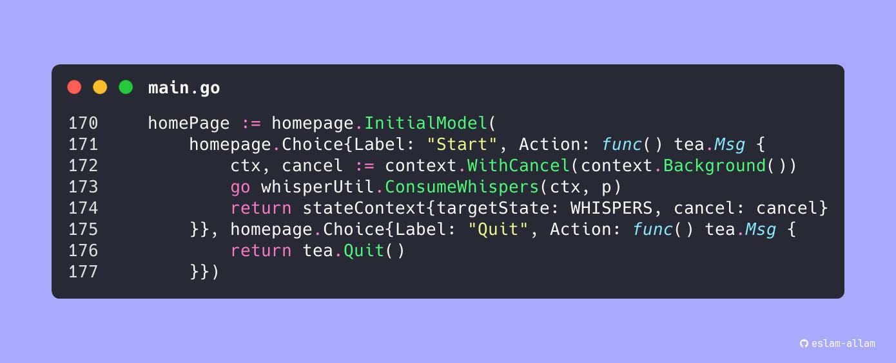

# Snap.nvim

Create beautiful code screenshots using [Silicon](https://github.com/Aloxaf/silicon)



> More examples can be found [here](./assets)

## Requirements

- NeoVim 0.9+ (can probably get away with earlier versions but I haven't
  tested them yet)
- Cargo for the auto installation (or install
  [Silicon](https://github.com/Aloxaf/silicon) yourself first)
- [**Optional**] ImageMagick (For applying the watermark)

## Setup

### Lazy

All these values are defaults and can be overridden in your config. Although
the setup function must be called with or without opts.

```lua
return {
  "eslam-allam/snap.nvim",
  -- Installs silicon using cargo. Remove if you wish to manually install silicon.
  build = ":SnapBuild",
  opts = {
    -- Action done when no action is specified. Can be "clipboard" or "file".
    default_action = "clipboard",
    -- Don't show line numbers in screenshot.
    hide_ln_numbers = false,
    -- Use sharp edges for code frame.
    no_rounded_corners = false,
    -- Don't show close, full screen, and minimize buttons.
    hide_controls = false,
    -- Don't add window title (See 'window_title' below).
    hide_window_title = false,
    -- Hex color used in background. Superseded by background_image if not nil.
    background_colour = "#aaaaff",
    -- Path to image to use as background. Must be absolute. May use '~' for $HOME.
    background_image = nil,
    -- If true then line numbers will be the same as the lines in your code.
    -- If false then line numbers will start at 1.
    line_offset = false,
    -- Space between lines.
    line_pad = 2,
    -- Horizontal padding between code and edge of screen.
    pad_h = 80,
    -- Vertical padding between code and edge of screen.
    pad_v = 100,
    shadow_blur_radius = 0,
    shadow_color = "#555555",
    shadow_offset_x = 0,
    shadow_offset_y = 0,
    tab_width = 4,
    -- Can be a theme name (see 'silicon --list-themes') or
    -- a path to a .tmTheme file (Must be prefixed with tmTheme://)
    -- e.g.'tmTheme://~/Downloads/InspiredGitHub.tmTheme'
    theme = "Dracula",
    -- Path to save the screenshot if no path is provided.
    -- May be a String or a func(number):boolean.
    -- If It's a string then it must be a directory
    -- (will be created if it doesn't exist).
    -- The directory may be relative or absolute.
    -- e.g. "./snapshots/"
    -- If it's a function then it will be called with the current buffer number and
    -- it must return the file path (may be relative or absolute).
    default_path = function(_)
        return vim.fn.getcwd() .. "/" .. uuid() .. ".png"
    end,
    -- May be a string or func(number):string.
    -- If string then it will be expanded using vim.fn.expand().
    -- If it's a function then it will be called with the current buffer number.
    window_title = "%:t",
    -- [Highly Experimental] Water-mark options. Can be nil or a table.
    -- If nil then watermark is disabled.
    -- If it's a table then all fields are required. Default is nil.
    -- Water mark was tested on Linux X11.
    -- Clipboard with watermark functionality may be broken on Wayland
    -- or other operating systems.
    watermark = {
      -- Font used in watermark.
      font = "JetBrainsMono-NF-Regular",
      -- Color of generated text.
      font_color = "white",
      -- water mark text. Consider using a Nerd Font if you want to add special
      -- unicode chars.
      text = " eslam-allam",
      -- Location of generated watermark.
      -- Can be any of "NorthWest", "North", "NorthEast", "East", "SouthEast",
      -- "South", "SouthWest", "West", "Center", or "Tile"
      -- If "Tile" then a checker like pattern will be used to fill the screen.
      -- (see assets/tile.png)
      position = "NorthWest",
      -- Watermark font size.
      font_size = 25,
      -- watermark opacity. Must be between 0 and 1.
      opacity = 1
    }
  },

}
```

## Usage

This plugin provides two commands:

- Snap
- SnapBuild

### Snap

If called with no arguments then the default action is taken.
(See 'default_action' above).

Accepts two arguments:

- type="clipboard" or "file"
- file_path="full path given that type="file""

> file_path may be relative and may include "~" for $HOME

If no range is provided then user must be in visual mode and the highlighted
text will be used.

If a range is supplied then that will be used instead.

Example Usage:

- **Default action:**

```vim
:Snap
```

- **To Clipboard:**

```vim
:Snap type=clipboard
```

- **To file:**

```vim
:Snap type=file file_path=~/Downloads/test.png
```

- **To file with range:**

```vim
:'<,'>Snap type=file file_path=./codeSnaps/tile.png
```

### SnapBuild

- Installs Silicon using Cargo.
- Accepts no arguments.

```vim
:SnapBuild
```
